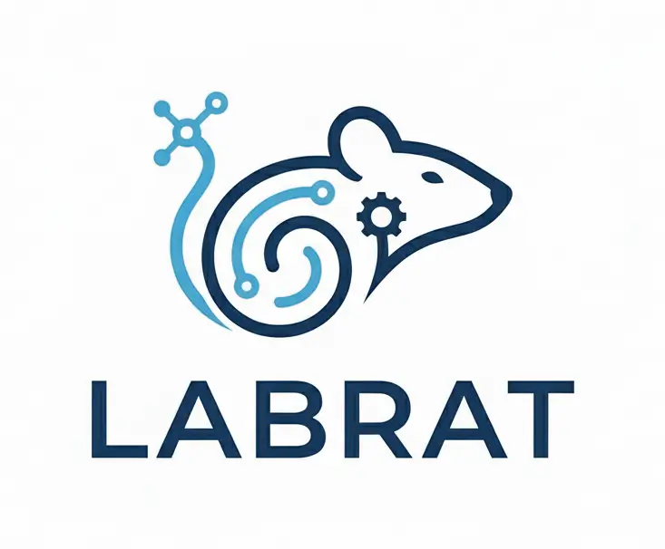

<p align="center">
  
</p>

# Labrat

Claude Code + [Yep Anywhere](https://github.com/kzahel/yepanywhere) in Docker for homelab remote access. Access Claude Code from any device via a web browser.

## Quick Start

Create a `compose.yaml`:

```yaml
services:
  labrat:
    image: ghcr.io/danjam/labrat:latest
    ports:
      - "3400:3400"
    volumes:
      - labrat-data:/home/labrat
      - ./workspace:/home/labrat/workspace
      # - ~/.ssh:/home/labrat/.ssh:ro          # SSH keys (for MCP SSH server)
    environment:
      - YEP_PASSWORD=changeme
      # - PUID=1000                            # Match host user UID
      # - PGID=1000                            # Match host group GID
      # - ANTHROPIC_API_KEY=sk-ant-...         # API billing
      # - CLAUDE_CODE_OAUTH_TOKEN=ak-ant-...   # Pro/Max subscription
      # - GITHUB_TOKEN=ghp_...
      # - ALLOWED_HOSTS=labrat.example.com
    init: true
    restart: unless-stopped

volumes:
  labrat-data:
```

```bash
docker compose up -d
```

Labrat serves HTTP on port 3400. You'll need a **reverse proxy with HTTPS** (e.g., Traefik, Caddy, nginx) in front of it — Yep Anywhere uses WebSockets, and browsers require a secure connection for that over the internet. Set `ALLOWED_HOSTS` to your domain so Yep accepts requests through the proxy.

The image is rebuilt automatically when Claude Code or Yep Anywhere release a new version (checked every 6 hours). Run `docker compose pull && docker compose up -d` to update.

## Building from Source

```bash
git clone https://github.com/danjam/labrat.git && cd labrat
cp .env.example .env              # Fill in API keys
docker compose up -d --build
```

## Authentication

### Claude Code

Three options (pick one):

**OAuth token (Pro/Max):** Run `claude setup-token` locally and set `CLAUDE_CODE_OAUTH_TOKEN` in `.env`. Uses your subscription — no API charges.

**API key:** Set `ANTHROPIC_API_KEY` in `.env`. Billed as pay-as-you-go API usage.

**Interactive login:** Leave both blank, start a Claude Code session in Yep Anywhere, and use `/login` to authenticate. Tokens persist in the `labrat-data` volume across restarts. After completing `/login`, wait a few seconds before sending messages — Claude Code may briefly respond with "Not logged in" while it picks up the new credentials.

## Workspace

All Claude Code project config lives in `./workspace/`, bind-mounted into the container:

| File | Purpose |
|------|---------|
| `CLAUDE.md` | Instructions and context for Claude Code sessions |
| `.mcp.json` | MCP server configuration (read by Claude Code automatically) |
| `.claude/` | Project settings (created by Claude Code at runtime) |

On first run the entrypoint auto-creates `CLAUDE.md` and `.mcp.json` from the bundled `.example` templates if they don't already exist. Edit them directly on the host — changes take effect on the next session.

The entrypoint also installs a set of Claude Code plugins into `workspace/.claude/settings.json` on every boot (idempotent): `claude-md-management`, `code-review`, `commit-commands`, `pr-review-toolkit`, and `ralph-loop`. These are project-scoped and persist in the workspace bind mount.

## MCP Servers

The image ships with `npx` and `uvx`, so most MCP servers work out of the box. Configure them in `workspace/.mcp.json`. API keys use `${VAR}` syntax — Claude Code reads them from the container's environment at runtime.

The starter config includes:

- **Context7** — documentation lookup
- **Brave Search** — web search
- **Gemini** — Google Gemini as a second AI model (requires `GEMINI_API_KEY`). Defaults to `gemini-2.5-flash`. Note: `gemini-2.5-pro` appears available but throws usage errors on the free API tier — a paid plan is required to use it.
- **SSH Session** — persistent SSH with async commands and SFTP

The `gh` CLI is also installed and authenticates via `GITHUB_TOKEN`.

## Secrets

API keys can be set as plain environment variables in `.env`, or via Docker's `_FILE` convention for file-based secret injection:

```bash
# Plain
ANTHROPIC_API_KEY=sk-ant-...

# File-based (Docker secrets, Kubernetes, etc.)
ANTHROPIC_API_KEY_FILE=/run/secrets/anthropic_api_key
```

Supported `_FILE` variables: `ANTHROPIC_API_KEY`, `CLAUDE_CODE_OAUTH_TOKEN`, `GEMINI_API_KEY`, `GITHUB_TOKEN`, `CONTEXT7_API_KEY`, `BRAVE_API_KEY`, `YEP_PASSWORD`. To add more, edit the `SECRETS_WHITELIST` in `entrypoint.sh`.

## Configuration

| Variable | Default | Description |
|----------|---------|-------------|
| `PORT` | `3400` | Host port for Yep Anywhere |
| `PUID` | `1000` | Container user UID — match your host user for bind mount permissions |
| `PGID` | `1000` | Container group GID — match your host group for bind mount permissions |
| `YEP_PASSWORD` | | **Required.** Password for the Yep Anywhere web UI |
| `ALLOWED_HOSTS` | | Allowed hostnames when behind a reverse proxy |
| `ANTHROPIC_API_KEY` | | Claude Code API key (pay-as-you-go) |
| `CLAUDE_CODE_OAUTH_TOKEN` | | Claude Code OAuth token (Pro/Max subscription) |
| `GITHUB_TOKEN` | | GitHub PAT for `gh` CLI |
| `GEMINI_API_KEY` | | Gemini MCP server API key |
| `CONTEXT7_API_KEY` | | Context7 MCP server |
| `BRAVE_API_KEY` | | Brave Search MCP server |

## Links

- [Claude Code docs](https://code.claude.com/docs/en/setup)
- [Yep Anywhere](https://github.com/kzahel/yepanywhere)
